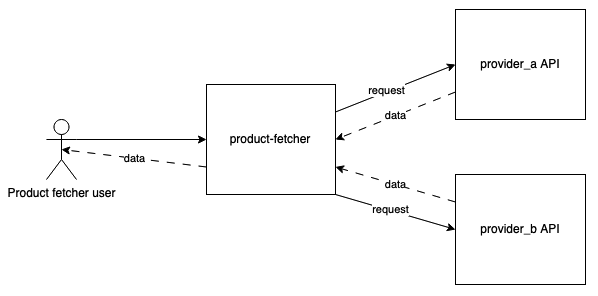

## Local dev environment

Environment is build on Symfony Docker, so for more information you can visit [Symfony Docker page](https://github.com/dunglas/symfony-docker).


## Getting Started

1. If not already done, [install Docker Compose](https://docs.docker.com/compose/install/) (v2.10+)
2. Run `docker compose build --pull --no-cache` to build fresh images
3. Run `docker compose up` (the logs will be displayed in the current shell)
4. Open `https://localhost` in your favorite web browser and [accept the auto-generated TLS certificate](https://stackoverflow.com/a/15076602/1352334)
5. Run `docker compose down --remove-orphans` to stop the Docker containers.
6. Mock provider API can be accessed by url1:  [http://localhost:8091/products](http://localhost:8091/products) and [http://localhost:8092/get_products](http://localhost:8092/get_products)


## Requirements for Product Fetcher
Review system which covers:
1. Get preferred (by ID) product data from the preferred (provider/marketplace ID) provider
2. Designed RESTful endpoint (endpoints) to get product data from two different providers (provider_a, provider_b)
3. The product ID is the same on all providers
4. Provider IDs are provider_a, provider_b
5. Designed Product Fetcher endpoint(s) always returns the same resource
6. Now the full implementation is done in App\Controller\ProductController::productData() 

Product Fetcher diagram 



## Usage example

Here is request example to get preferred product data from preferred provider:
```shell
curl --location --request POST 'localhost/get_product_data' \
--header 'Content-Type: application/json' \
--data-raw '{
    "marketplace": "<provider>",
    "item_id":2
}'
```
For `<provider>` - `provider_b` or `provider_a` can be used.


API has 3 items with ids: [1, 2, 3].
